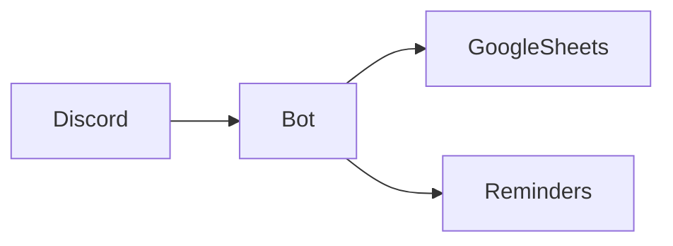

# Discord Task Manager Bot

A Google Sheets-powered task manager for Discord teams with automated reminders.

## 🛠️ Installation
```bash
git clone https://github.com/your-repo/discord-task-bot.git
cd discord-task-bot
npm install
```

## 🔧 Configuration
1. Rename `.env.example` to `.env`:
   ```ini
   DISCORD_TOKEN=your_bot_token
   GOOGLE_SHEETS_ID=your_sheet_id
   ```
2. Add Google Service Account `credentials.json`

## 🚀 Deployment
| Platform       | Guide                               |
|----------------|-------------------------------------|
| Local          | `node index.js`                     |
| Railway        | Upload + set env vars               |
| Replit         | Paste `credentials.json` in Secrets |

## 📜 Commands
| Command        | Usage                                |
|---------------|--------------------------------------|
| `/task add`   | `description` (req), `due`, `assignee` |
| `/task list`  | `group:Alpha/Beta/Gamma` (optional)   |
| `/mytasks`    | Shows your assigned tasks            |

## ⚙️ Architecture


[📝 Full Command Reference](COMMANDS.md) | [🐛 Report Issues](ISSUES.md)
```

---
